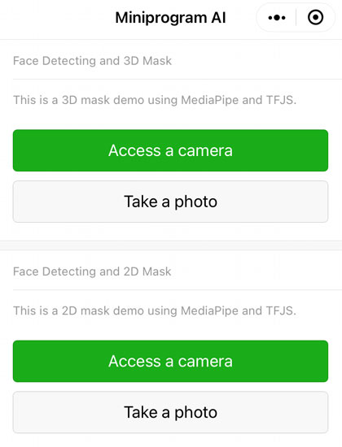
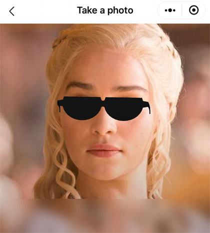
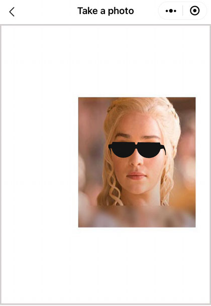
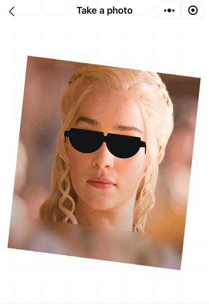
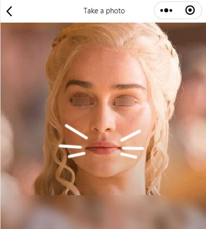
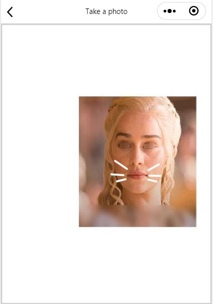
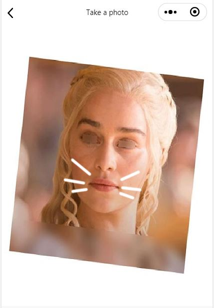

[Chinese README](https://zhuanlan.zhihu.com/p/81636351)  

## Updated

| Date　　　| Update |
| -- | -- |
| 2021-07-21 | New: This project is the same as https://github.com/sanyuered/WeChat-MiniProgram-AR-TFJS, but it is a pure front-end website.|


## Visit a live example

https://sanyuered.github.io/AR-TFJS/

## Introduction of Web AR with TFJS

TensorFlow.js is a library for machine learning in JavaScript. 

We can create AR effects with TensorFlow.js. A "face-landmarks-detection" library is based on TensorFlow.js.

The "face-landmarks-detection" library offers a face detection in the browser environment. 

[face-landmarks-detection](https://github.com/tensorflow/tfjs-models/tree/master/face-landmarks-detection)

This demo demonstrates a face AR. 

Index Page of the WeChat Mini-program



## Face Detecting and 3D Mask

Use the demo to scan a face. Expect a effect below.



A effect of translating and scaling.



A effect of rotating.



## Face Detecting and 2D Mask

Use the demo to scan a face. Expect a effect below.



A effect of translating and scaling.



A effect of rotating.




## Set the url of the "TensorFlow.js" model

You can search keywords that are "/tfjs/blazeface_v1" and "/tfjs/facemesh_v1" in the "facemesh.js" file. 

File: /third_party/facemesh.js

```javascript
n.loadGraphModel("/tfjs/blazeface_v1",
```

```javascript
n.loadGraphModel("/tfjs/facemesh_v1",
```

## Set the url of the 3D model

You may replace the default url of a gltf model for 3D mask.

File: /package_face_3d_mask/photo/photo.js and 
/package_face_3d_mask/camera/camera.js

```javascript
// a url of a gltf model 
const modelUrl = '../../assets/sunglass.glb';
```

## Set the url of the 2D sprite image

You may replace the default url of a image for 2D mask.

File: /package_face_2d_mask/photo/photo.js and /package_face_2d_mask/camera/camera.js

```javascript
// a url of a image 
const modelUrl = '../../assets/cat_beard.png';
```

## How to put a 3D model or a mask image on an other position

This is a map of the 486 keypoints of a face.

[486 keypoints Map](https://github.com/tensorflow/tfjs-models/raw/master/face-landmarks-detection/mesh_map.jpg)

For example, a number 168, number 122 and number 351 are the middle of the eyes.

File: /package_face_3d_mask/utils/modelBusiness.js

```javascript
// index of the track points of the face
const trackPointA = 168;
const trackPointB = 122;
const trackPointC = 351;
```

For example, a number 0, number 61 and number 291 are the mouth.

File: /package_face_2d_mask/utils/modelBusiness.js

```javascript
// index of the track points of the face
const trackPointA = 0;
const trackPointB = 61;
const trackPointC = 291;
```